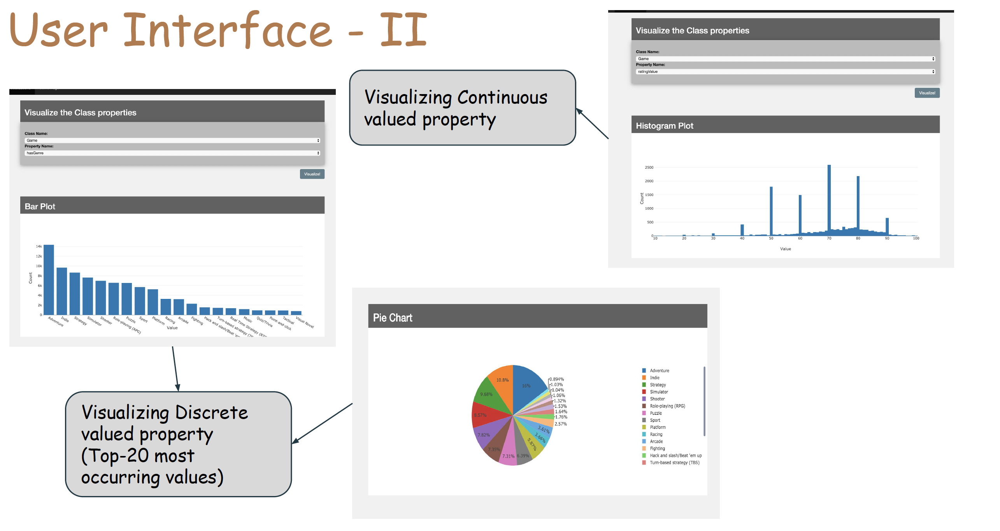

# Game-and-Requirements-KG
Building a Knowledge Graph about Games, Requirements and Purchase source! 

## Project Submissions

**Project Demo**: The youtube video about our project demo can be found here: [https://www.youtube.com/watch?v=wa_C4xqBmjo](https://www.youtube.com/watch?v=wa_C4xqBmjo)  
**Project Presentation Slides**: The project presentation slides can be found here: [Slides](submissions/rselvam_rvohra_INF558_final_project_presentation.pdf)  
**Project Report**: The project report can be found here: [Report](submissions/rselvam_rvohra_INF558_final_project_report.pdf)  

## Modules

### 1. Crawling

​		a) Games information was crawled from [IGDB.com](https://www.igdb.com/discover)	

​		b) Information about the system specifications required to play a particular game, the cheapest purchase source was crawled from [G2A.com](https://www.g2a.com)

​		c) The details about all the CPU's and GPU's was crawled from [Techpower.com](https://www.techpowerup.com)

​		d) The baseline information about the performance scores for the CPU and GPU was crawled from [Passmark.com](https://www.passmark.com)

The code for all these crawling tasks can be found [here](https://github.com/ravikiran0606/Game-and-Requirements-KG/tree/master/1_crawling/crawlers)

### 2. Entity Resolution

​		a) The first entity resolution task that we handled was mapping the games crawled from IGDB to the games crawled from G2A. This mapping was necessary to enrich the games with information like the device specifications, cheapest purchase source. Code can be found [here](https://github.com/ravikiran0606/Game-and-Requirements-KG/blob/master/2_entity_resolution/ER_igdb_g2a_rijul.py)

​		b) The second entity linking task that we did was to map the CPU and GPU information from G2A to the CPU and GPU information crawled from techpowerup. The entity linking code for the CPU can be found [here](https://github.com/ravikiran0606/Game-and-Requirements-KG/blob/master/2_entity_resolution/ER_g2a_cpu_techpowerup_cpu_v1.py). Code for GPU linking can be found [here](https://github.com/ravikiran0606/Game-and-Requirements-KG/blob/master/2_entity_resolution/ER_g2a_games_gpus_and_techpowerup_gpus.py)

​		c) Code for linking the CPU information from techpowerup to get the benchmark score from Passmark can be [here](https://github.com/ravikiran0606/Game-and-Requirements-KG/blob/master/2_entity_resolution/ER_techpowerup_cpubenchmark.py). Similar code for the GPU can be found [here](https://github.com/ravikiran0606/Game-and-Requirements-KG/blob/master/2_entity_resolution/ER_benchmark_gpus_and_techpowerup_gpus.py)	

### 3. Ontology Mapping

We designed our own ontology. Our ontology for this project has a total of 7 classes. We inherited some of the classes and properties from schema.org and customized others according to our needs. The entire ontology file can be found [here](https://github.com/ravikiran0606/Game-and-Requirements-KG/blob/master/3_ontology_mapping/Game%20Requirements%20Ontology.pdf)

### 4. CPU and GPU Comparison

### 5. Building the KG

### 6. Querying the KG

### 7. Evaluation

### 8. Node Embeddings

We compute the embeddings for each of the game nodes using the fastText pre-trained embeddings as shown in the below figure, 

1. First, we calculate the embeddings for the game's components like name, description, genre, theme, and game mode. 
2. Then, the game node embedding is created by the weighted average of the individual game components' embeddings. 
The weights were determined heuristically to build a game recommendation system.

## Personalized Game Recommendation System

We build a personalized game recommendation system using the game node embeddings.

For a given source game and a user device, to recommend the top-5 similar games, we follow the steps below,

1. First, we filter only the games with rating >= 80 among all the games (except the source game).
2. We then apply a second filter to retain only the games that the user can play on his device (i.e., the game works on the user device)
3. Finally, we rank those filtered games by the cosine similarity score between their game node embedding and the source game node embedding and display the top-5 recommendations.

## Web-App User Interface:

The user interface of our web application is shown in the below figures,

(readme yet to be completed)

